# Smart Resume

[English](./README.md)

Smart Resume 是一个支持多用户的私有化简历工作台，用于编写、优化、分享简历，并结合 AI 完成评分和模拟面试。仓库由 Spring Boot 后端与 React + Vite 前端组成，围绕一条完整工作流展开：账号注册与登录、结构化编辑、实时预览、模板切换、简历评分、公开分享、PDF 导出与模拟面试。

## 核心亮点

- 多用户账号体系，支持注册与登录，管理员可控制是否开放注册
- 简历工作台支持多份简历的创建、复制、删除与恢复
- 结构化编辑器配合实时预览，支持模块显隐与布局调整
- 支持内置模板与自定义模板
- 内置 AI 配置、简历助手对话、简历评分与模拟面试能力
- 支持生成公开分享链接，并可选密码保护
- 提供两种 PDF 导出方式：
  - 快速导出：浏览器端截图（`html2canvas` + `jspdf`），与预览像素一致
  - 高质量导出：服务端 Playwright + Chromium 渲染，输出的是真实文本、ATS 友好的 PDF，且与前端预览像素级一致

## 产品导览

### 访问与工作台


注册新账号或使用用户名密码登录，进入你的私人简历工作台。

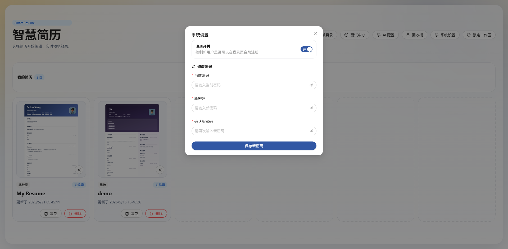

在工作台中管理系统设置：开关公开注册（仅管理员）、修改密码、配置 AI 提供方。

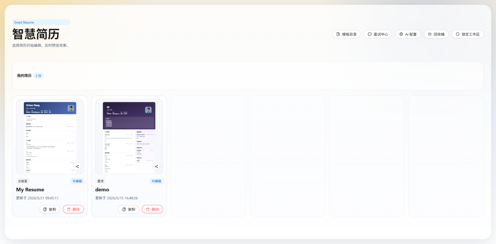

在主工作台中管理多份简历，并快速进入模板中心、面试中心、AI 配置与回收桶。

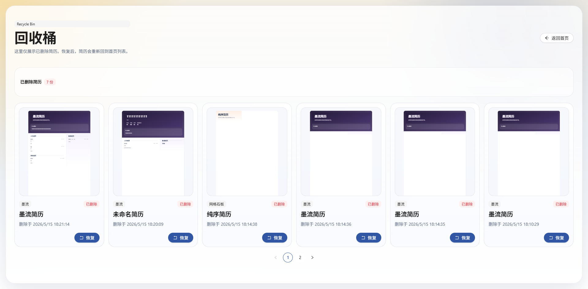

已删除的简历会进入回收桶，方便在同一工作流里直接恢复。

### 编辑与模板

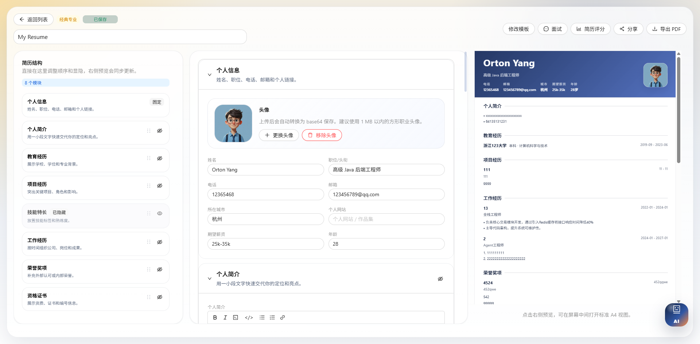

左侧维护结构化简历内容，右侧实时查看渲染后的简历预览效果。

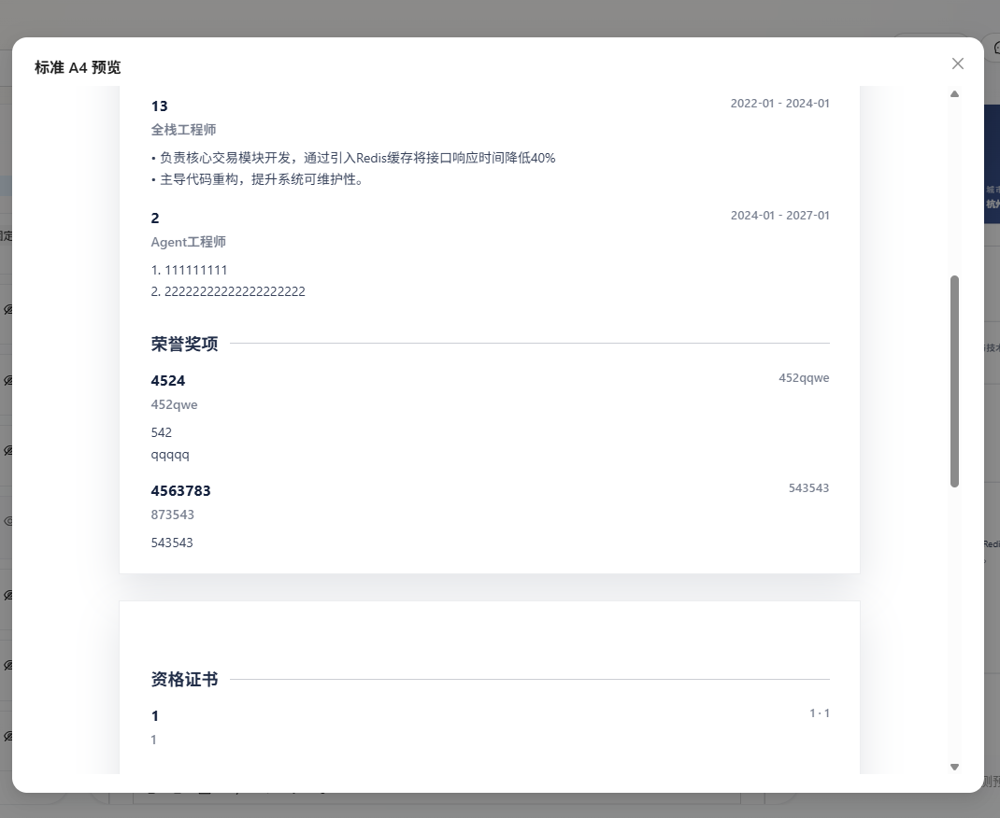

可打开标准 A4 预览窗口，在导出或分享前检查版式细节。

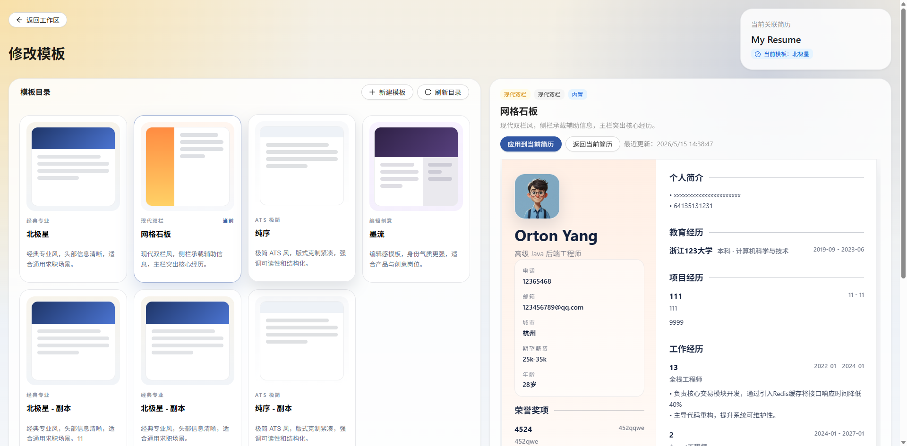

可以在内置模板之间切换，也可以从现有模板出发创建自定义版本。

### AI 辅助流程

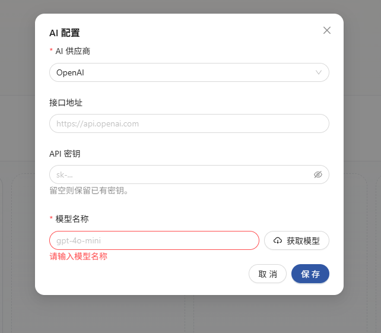

通过界面配置 OpenAI 兼容接口、DeepSeek 或 Ollama，无需把提供方信息写死在前端代码中。

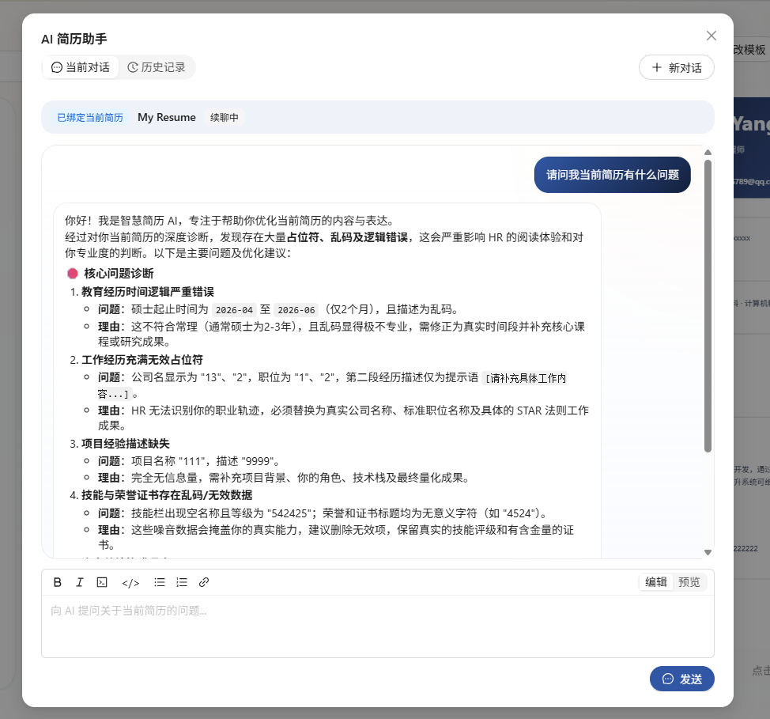

在编辑器内直接与 AI 简历助手多轮对话，并按建议定向优化简历内容。

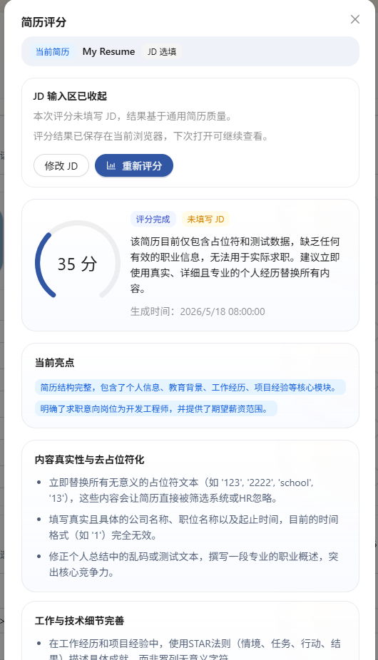

支持按通用质量标准或目标 JD 对简历进行评分，并查看结构化反馈结果。

### 分享与面试

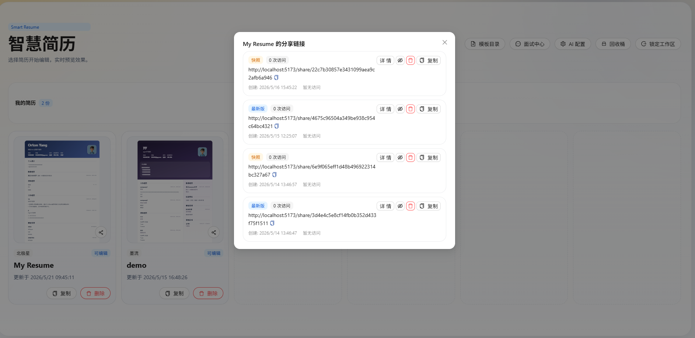

生成公开分享链接，选择分享模式，并可按需启用密码保护。

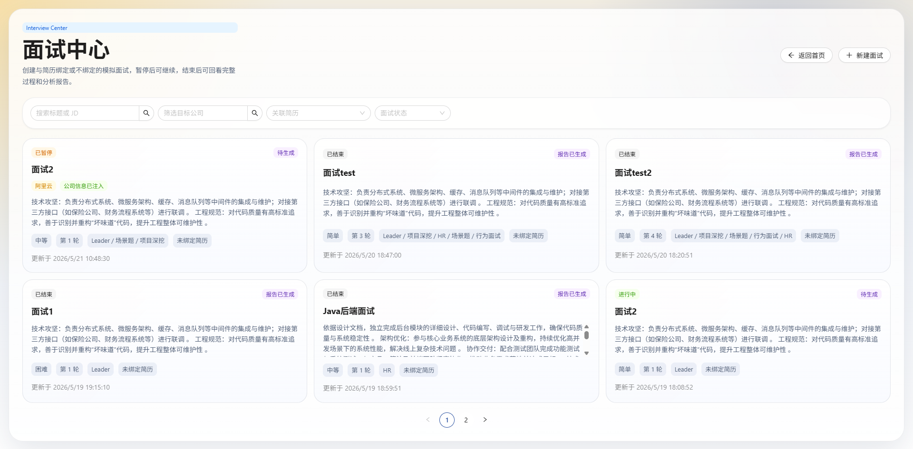

创建模拟面试、跟踪面试进度，并查看生成后的面试报告。

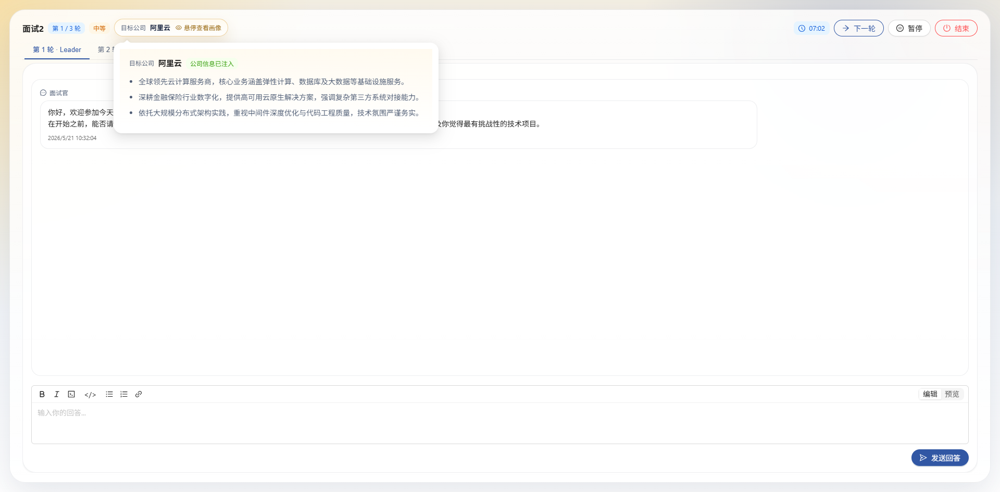

在面试工作区中进行计时答题、查看企业信息补充，并直接提交当前轮回答。

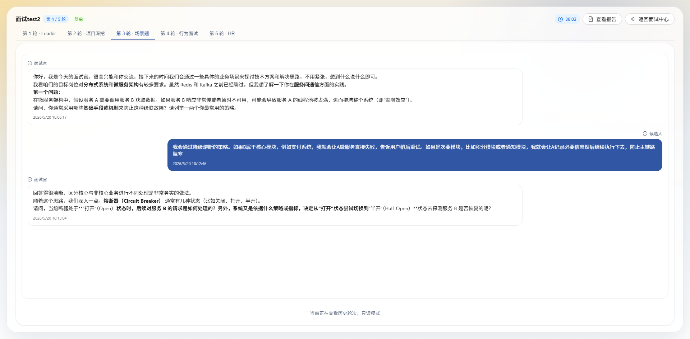

需要复盘时，可以只读方式查看之前轮次的问题与回答记录。

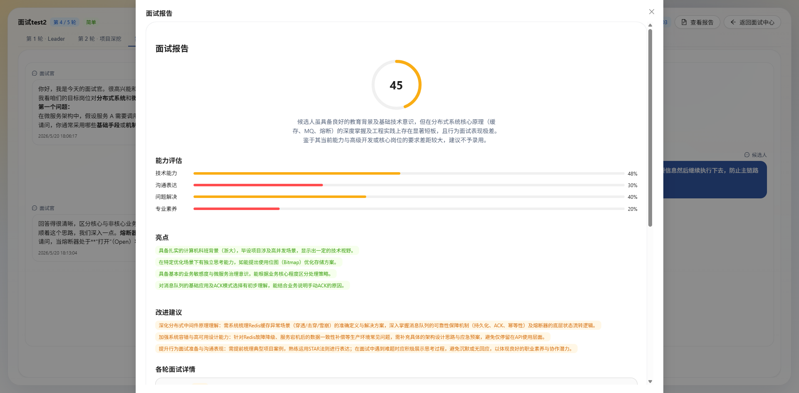

查看生成后的面试报告，包括总分、维度评估、亮点总结和改进建议。

## 技术栈

### 后端

- Java 21
- Spring Boot 3.5
- PostgreSQL
- Flyway
- MyBatis-Flex
- Spring AI

### 前端

- React 19
- TypeScript
- Vite
- Ant Design
- React Router 7
- `html2canvas` + `jspdf`，用于前端侧的快速 PDF 导出

### PDF 导出管线（可选，服务端）

- Playwright + 无头 Chromium 用于高质量、ATS 友好的 PDF 导出
- 直接复用编辑器中的 React 预览组件渲染，因此服务端 PDF 与实时预览像素级一致

## 仓库结构

```text
smart-resume/
|-- backend/   Spring Boot API、数据库迁移与领域服务
|-- docs/      README 截图与辅助资源
|-- frontend/  简历工作台、编辑器、分享页与面试流程前端应用
`-- .trellis/  项目流程、规范与任务记录
```

## 快速开始

### 环境要求

- Java 21
- Node.js 20.19+ 与 npm
- PostgreSQL

如需使用 AI 能力，还需要以下之一：

- OpenAI 兼容接口的 API Key
- DeepSeek API Key
- 或本地 Ollama 服务

### 1. 克隆仓库

```bash
git clone <your-repo-url>
cd smart-resume
```

### 2. 准备 PostgreSQL

创建名为 `smart_resume` 的数据库：

```sql
CREATE DATABASE smart_resume;
```

后端默认配置如下：

- 数据库地址：`jdbc:postgresql://localhost:5432/smart_resume`
- 用户名：`postgres`
- 密码：`postgres`
- 后端端口：`8080`

如果本地环境不同，可以通过环境变量覆盖：

```bash
export SMART_RESUME_DB_URL=jdbc:postgresql://localhost:5432/smart_resume
export SMART_RESUME_DB_USERNAME=postgres
export SMART_RESUME_DB_PASSWORD=postgres
export SMART_RESUME_BACKEND_PORT=8080
export SMART_RESUME_TOKEN_SECRET=change-this-secret
```

如果你使用 PowerShell，请把 `export` 换成 `$env:变量名='值'`。

### 3. 安装前端依赖

```bash
cd frontend
npm install
cd ..
```

## 启动项目

可以选择"一键脚本"（适合生产风格部署）或"双终端"（适合开发调试）两种方式。

### 方式 A：一键脚本（生产风格）

在项目根目录执行：

```bash
./start.sh
```

脚本会依次完成：

1. 检查 Node.js（≥ 20）和 Java（≥ 21）版本，不满足则直接报错退出，**不会**自动切换版本，请先 `nvm use 20`（或同等命令）切到合适版本。
2. 安装前端依赖并构建前端（多入口：`index.html` 用于应用，`export.html` 用于服务端 PDF 渲染）。
3. 把构建好的 `frontend/dist/` 同步到 `backend/src/main/resources/static/`，让 Spring Boot 直接 serve。
4. 打包后端 JAR。
5. 检查 Playwright 自带的 Chromium 是否已安装，只有缺失时才安装（高质量 PDF 导出所需）。
6. 启动后端，同一端口同时提供 API 和前端页面。

如果只想构建不启动，可使用：

```bash
./build.sh
```

### 方式 B：双终端（开发调试）

适合需要前端热更新的开发场景。

#### 终端 1：启动后端

```bash
cd backend
./mvnw spring-boot:run
```

启动时会自动执行 Flyway 数据库迁移。

#### 终端 2：启动前端

```bash
cd frontend
npm run dev
```

然后在浏览器中打开 Vite 输出的地址，通常是 `http://localhost:5173`。

前端默认请求 `http://localhost:8080`。如果你需要改为其他后端地址，可以这样配置：

```bash
cd frontend
echo 'VITE_API_BASE_URL=http://localhost:8080' > .env.local
npm run dev
```

开发模式下，**高质量（服务端）PDF 导出**会不可用——后端找不到 `static/export.html`，相关 API 会返回 503 并附带本地化错误提示。**快速（前端）PDF 导出**在开发模式下仍然可用。如需在开发期间联调服务端导出，先执行一次 `./build.sh` 然后用产出的 JAR 启动后端即可。

## 首次使用

当前后端与前端都启动后：

1. 在浏览器中打开前端页面。
2. 使用默认管理员账号登录：用户名 `admin`，密码 `admin123`。
3. 登录后请立即在系统配置中修改默认密码。
4. 公开注册默认开启，其他用户可自行注册新账号。

## AI 提供方

AI 功能通过应用内界面进行配置。当前后端支持：

- OpenAI 兼容接口
- DeepSeek
- Ollama

这些能力主要用于简历对话助手、简历评分、面试生成与面试报告生成。

## 补充说明

- 公开分享页既支持无密码访问，也支持密码保护。已登录用户和分享访客都可以下载高质量 PDF（前提是服务端已配置好导出能力）。
- PDF 导出有两条路径：
  - **快速导出**（前端 `html2canvas` + `jspdf`）：始终可用，浏览器端生成。输出是图片型 PDF，文本不可选、ATS 无法解析。
  - **高质量导出**（服务端 Playwright + Chromium）：输出真实文本、ATS 友好、与前端预览像素级一致的 PDF。需要先执行 `start.sh` / `build.sh`，把前端 `dist/` 同步到 `static/`，并检查 Chromium，缺失时才安装。
  - 如果服务器缺少其中任意一项（前端资源未复制、或 Chromium 未安装），后端仍可正常启动；只有高质量导出接口会返回 503 并附带本地化错误提示，其他功能不受影响。
- 前端还有单独的包级文档可参考：[frontend/README.md](./frontend/README.md)。

## 开源协议

Smart Resume 基于 Apache License 2.0 发布。完整协议见 [LICENSE](./LICENSE)，归属说明见 [NOTICE](./NOTICE)。
